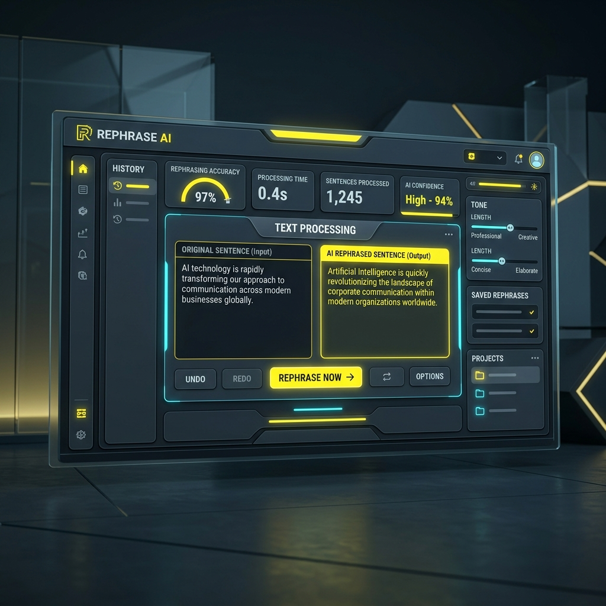

<p align="center">
  
</p>

<h1 align="center">TRNT BEE</h1>

<p align="center">
A Student-Led Software Studio Building AI-Powered Products, Intelligent Platforms, and Modern Digital Solutions.
</p>

<p align="center">


</p>

---

# About TRNT BEE

TRNT BEE is a student-led software studio focused on designing, developing, and deploying modern digital products powered by artificial intelligence, cloud technologies, cybersecurity, and intelligent automation.

Rather than building isolated applications, TRNT BEE develops interconnected products that solve real-world problems across multiple industries including education, travel, productivity, cybersecurity, artificial intelligence, entertainment, and gaming.

Our philosophy is centered around building scalable software that combines modern engineering practices, intuitive user experiences, and practical innovation to create products that deliver measurable value.

Every project within the ecosystem is designed with long-term maintainability, modular architecture, and continuous improvement in mind, allowing the platform to evolve alongside modern technologies and user needs.

---

# Vision

To build one of India's leading software product companies by creating intelligent digital platforms that simplify everyday life through technology, innovation, and artificial intelligence.

TRNT BEE aims to develop products that are accessible, scalable, secure, and capable of serving users across multiple industries while continuously expanding into new technological domains.

---

# Mission

Our mission is to transform innovative ideas into practical software solutions by combining modern software engineering, artificial intelligence, cloud computing, and user-centered design.

We strive to create products that improve productivity, enhance learning, simplify workflows, strengthen security, and deliver exceptional digital experiences.

---

# Core Values

| Principle | Description |
|------------|-------------|
| Innovation | Building practical solutions through continuous experimentation and modern technologies. |
| Quality | Developing software that is reliable, scalable, and maintainable. |
| Simplicity | Creating intuitive user experiences without unnecessary complexity. |
| Security | Prioritizing privacy, secure development practices, and responsible software engineering. |
| Continuous Learning | Improving products through research, feedback, and evolving technologies. |

---

# Product Ecosystem

| Category | Product |
|----------|----------|
| Travel Technology | TrekVana |
| Education Technology | BeePrepare |
| Artificial Intelligence | HiveMind |
| Artificial Intelligence | RephraseBee |
| Artificial Intelligence | LetsCook |
| Productivity | BeeFile |
| Cybersecurity | Thrufter |
| Entertainment | 5IndShow |
| Gaming | UniPlay |
| Gaming | One Punch Fall |

---
# Product Portfolio

TRNT BEE is built around a collection of interconnected software products, each addressing a different real-world domain while following common engineering standards and modern development practices.

<br>

<p align="center">
  
  &nbsp;
  
</p>
<p align="center">
  
  &nbsp;
  
</p>
<p align="center">
  
  &nbsp;
  
</p>
<p align="center">
  
  &nbsp;
  
</p>
<p align="center">
  
</p>

<br>

| Product | Domain | Status |
|---------|--------|--------|
| TrekVana | Intelligent Travel Platform | Active Development |
| BeePrepare | Educational Technology | Active Development |
| HiveMind | Multi-AI Intelligence Platform | Active Development |
| BeeFile | Document Management Platform | Active Development |
| RephraseBee | AI Writing Assistant | Active Development |
| LetsCook | AI Recipe Platform | Active Development |
| Thrufter | AI Security Intelligence Framework | Research & Development |
| UniPlay | Browser Gaming Platform | Active Development |
| One Punch Fall | 3D Endless Runner Game | Active Development |
| 5IndShow | Entertainment Discovery Platform | Active Development |

---

# Technology Stack

### Frontend


### Backend


### Database


### Artificial Intelligence

- Large Language Models
- Intelligent Automation
- AI Content Generation
- Multi-Model Reasoning
- Recommendation Systems
- Natural Language Processing

### Cloud & Deployment


---

# Engineering Principles

Every product developed under TRNT BEE follows a common engineering philosophy.

| Principle | Objective |
|------------|-----------|
| Modular Architecture | Independent and maintainable components |
| Scalability | Designed to support future growth |
| Security First | Secure coding and data protection |
| Performance | Optimized user experience |
| Accessibility | Inclusive and responsive interfaces |
| Documentation | Professional technical documentation |
| Continuous Improvement | Regular feature enhancements and optimization |

---

# System Architecture

```text
                            Users
                               │
                               ▼
                    TRNT BEE Product Ecosystem
                               │
      ┌──────────────┬──────────────┬──────────────┐
      │              │              │
      ▼              ▼              ▼
Artificial      Productivity     Entertainment
Intelligence      Platforms        & Gaming
      │              │              │
      └──────────────┼──────────────┘
                     ▼
              Cloud Infrastructure
                     │
      MongoDB • Firebase • Cloudinary
                     │
                     ▼
           Deployment & Global Delivery
             Cloudflare • Vercel
```

---

# Current Focus Areas

- Artificial Intelligence
- Cybersecurity
- Educational Technology
- Travel Technology
- Productivity Solutions
- Browser Applications
- Game Development
- Cloud-Based Software
- Research & Innovation

---
# Development Roadmap

## Phase 1

- Company Portfolio
- Product Documentation
- GitHub Organization
- Product Deployments
- Brand Identity
- Engineering Standards

---

## Phase 2

- AI Product Expansion
- Cybersecurity Research
- Mobile Applications
- Browser Extensions
- Developer APIs
- Cloud Infrastructure
- Authentication Services

---

## Phase 3

- Enterprise Solutions
- SaaS Platforms
- Open Source Initiatives
- Global Product Launches
- AI Research
- International Expansion
- Developer Community

---

# Open Source

TRNT BEE believes in continuous learning and collaborative software development.

Selected projects will gradually become open source to encourage innovation, knowledge sharing, community contributions, and engineering excellence.

Developers are encouraged to contribute by improving documentation, reporting issues, optimizing performance, enhancing security, and proposing new ideas.

---

# Repository Standards

Every TRNT BEE repository follows a consistent engineering structure.

```text
README.md

LICENSE

CHANGELOG.md

CONTRIBUTING.md

SECURITY.md

CODE_OF_CONDUCT.md

ROADMAP.md

ARCHITECTURE.md

docs/

assets/

src/
```

---

# Project Philosophy

TRNT BEE is built around one simple belief.

Software should not only solve problems—it should remain scalable, maintainable, secure, and continuously improve as technology evolves.

Every product within the ecosystem is developed with long-term sustainability, modular architecture, and modern engineering practices as its foundation.

Rather than creating isolated applications, our goal is to establish an ecosystem of intelligent digital products that work together while delivering meaningful value across multiple industries.

---

# Statistics

| Category | Count |
|-----------|------:|
| Software Products | 10 |
| AI Platforms | 3 |
| Productivity Platforms | 2 |
| Gaming Projects | 2 |
| Entertainment Platforms | 1 |
| Cybersecurity Platforms | 1 |
| Travel Platforms | 1 |
| Education Platforms | 1 |

---

# Contributing

Contributions are welcome from developers, designers, researchers, technical writers, testers, and students.

Please read the contribution guidelines before submitting pull requests.

We value clean code, clear documentation, respectful collaboration, and continuous improvement.

---

# License

This organization and its projects are released under the MIT License unless stated otherwise.

See the LICENSE file within each repository for additional information.

---

# Contact

| Platform | Link |
|----------|------|
| Portfolio | https://trntbee.trntbeeofficial.workers.dev |
| GitHub | https://github.com/VarshithRao101 |
| Email | trntbeeofficial@gmail.com |
| LinkedIn | https://www.linkedin.com/in/varshith-rao |

---

# Founder

<p align="center">
  
</p>

**Varshith Rao**

Founder & Developer at **TRNT BEE**

Building intelligent software products across Artificial Intelligence, Cybersecurity, Education, Productivity, Travel Technology, Gaming, and Cloud Applications.

---

<p align="center">
  
</p>

<p align="center">

**TRNT BEE**

Building Intelligent Software for Tomorrow.

</p>
